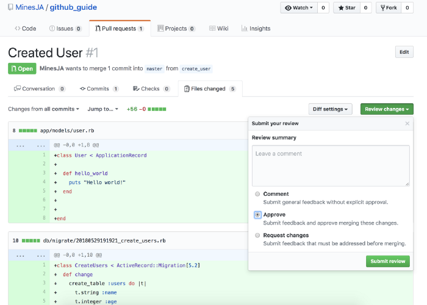

<!-- PROJECT LOGO -->
<br />
<p align="center">
  <a href="https://github.com/GPZ-Bioinfo">
    
  </a>

  <h3 align="center">Github collaborate guide</h3>

  <p align="center">
    Notes of github collaboration integrated with Pycharm.
    <br>
  </p>
</p>


## Table of Contents
- [Getting Started](#Getting-Started)

    - [Create a new repository](#Create-a-new-repository)

    - [Setup collaborators](#Setup-collaborators)

    - [Collaborating](#Collaborating)

        - [Branch usage](#Branch-usage)

        - [Submit PRs](#Submit-PRs)

        - [Review and merge branches](#Review-and-merge-branches)
        
- [Contributing](#Contributing)

- [Reference](#Reference)


<!-- GETTING STARTED -->
## Getting Started

Now start to try the github workflow. This note shows each step of github collaboration 
with charts or code blocks, to complement Chinglish expression :no_good: 

### Create a new repository

First, start with initiate a project, [creating a new repository](https://docs.github.com/en/github/creating-cloning-and-archiving-repositories/creating-a-new-repository) 
in github. 

Log in with github account and click "+" in the upper-right corner, then select __New Repository__.

 

Type a name, and optional description for your repository.


Then, choose __visibility__ of repository, for _public_ or _private_, which is important if the 
repository not planned to publish right now.


Now you have an empty repository. Switch to the terminal and locating into your local project,
push local project to remote github repository. You can simply follow the codes shown on the new repository page,
or try to:

1. clone this empty remote repository (with only directory `.git` in it) to local;

    ```git
    git clone https://github.com/username/reponame.git
    ```

2. locate to local repository (in default branch `master`), paste project files to this 
folder (remove unnecessary directories, e.g `.idea` and `__pycache__`);

    ```git
    cd reponame
    cp project_files .
    ```

3. add and commit these changes;

    ```git
    git add .
    git commit -m "Repo init"
    ```
    
4. now the local master is ahead of the remote, push to update remote github repository.
    ```git
    git push -u origin master
    ```
    check the remote repository on github, and you will see the initialized repository and 
    the reference to your first commit.

### Setup collaborators

Stop here and enjoy git exploration if teamwork is not required for your repository :wave:

Direct to the __Setting__ page of this repository, and select __Collaboratos__ in the navigator,
fill the chart with _user name_ or _email_ of the collaborator, then confirm to sent he/she the 
invitation email. 


The teamwork could be start once the invitation accepted by the user.

### Collaborating

If you are the team player in this repository, __don't fork__ the repository (fork will copy a 
new repository in your account), just clone the repository, and you and your team could work in
the same repository.

```git
git clone https://github.com/username/reponame.git
cd reponame
```

Ready to collaborate? Then keep one central rule in mind:
__THE MASTER BRANCH SHOULD ALWAYS BE DEPLOYABLE__. The proper way is working on branches then
merging to the master after review.

##### Branch usage

After locating to the local repository, you've in the `master` branch by default, create a new branch
to start your work. __Branches should always represent features__.

```git
git checkout -b new_feature
```

list all your local branch with this command, and verify you're in the `new_feature` branch.

```git
git branch --list
```

##### Submit PRs

__Frequently__ `add` and `commit` to record changes in the branch. `push` the branch when completed
your work. 

```git
git push
```

Now you submit a remote branch `new_feature`, click the __pull request__ button


and send your reviewer a notification to check and merge branches.


Congratulations for finishing works :fireworks:

##### Review and merge branches

If you are the reviewer of this repository, sorry to inform that your works just begin. Ready to
debug the PRs and handle the conflicts with the base branch?

1. You can review and merge on the github page once receive the notification (shown as below).
    
    
    
    

2. Alternatively, you can fetch the branch to local and work with `Pycharm`. 

    1. Fetch/Pull the base branch to local, skip it if the local master already up to date;
    
        ```git
        git pull origin master
        ```
    
    2. open local repository in `Pycharm`, then go to Branches popup in the 
    _right-lower corner_ and click on a branch you want to check and choose __Compare with current__
    
        
        
        click in and you can see changes comparing with local master are highlighting. 
        
        
        
    3. merge remote branch to local master could be done in `Pycharm`. Try this command for alternative way
    if you prefer merge with `git`.
    
        ```git
        git merge new_feature
        git push
        ```
        
     For more about `git merge` and conflicts resolving, [here](https://www.atlassian.com/git/tutorials/using-branches/git-merge)
     provides a good solution.

The branch could be delete if you don't need it anymore. 

```git
git branch -d new_feature
```

Above command could be execute when branch successfully merged to master. However, you can still
delete it without merging with captive `-D`:

```git
git branch -D new_feature
```

<!-- REFERENCE -->
## Reference

- [The Ultimate Github Collaboration Guide](https://medium.com/@jonathanmines/the-ultimate-github-collaboration-guide-df816e98fb67)

- [How to review others' code before git pull in PyCharm?](https://intellij-support.jetbrains.com/hc/en-us/community/posts/360009394839-How-to-review-others-code-before-git-pull-in-PyCharm-)

<!-- CONTRIBUTING -->
## Contributing

Contributions are what make the open source community such an amazing place to be learn, 
inspire, and create. Any contributions you make are **greatly appreciated**.

1. Fork the Project
2. Create your Feature Branch (`git checkout -b feature/AmazingFeature`)
3. Commit your Changes (`git commit -m 'Add some AmazingFeature'`)
4. Push to the Branch (`git push origin feature/AmazingFeature`)
5. Open a Pull Request
